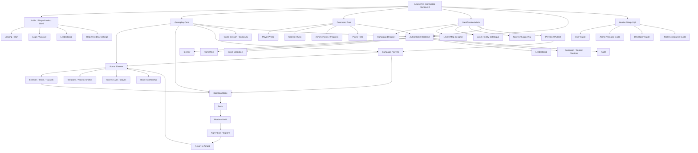
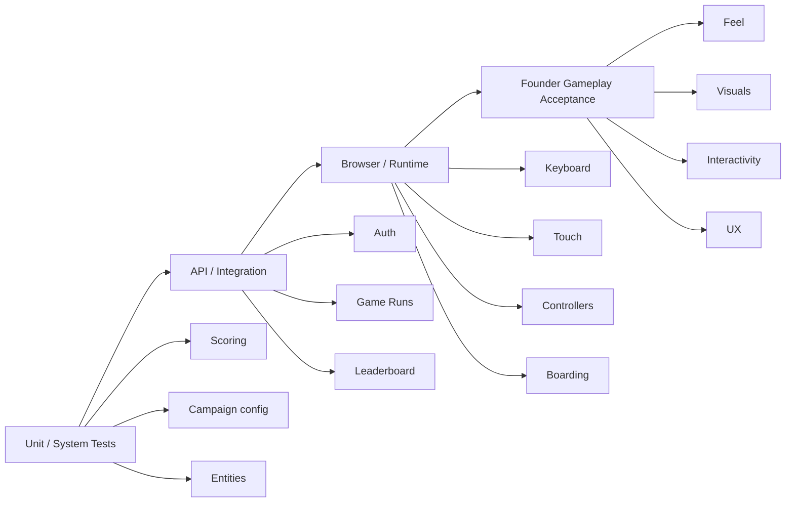
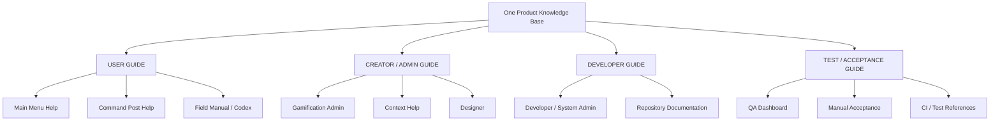
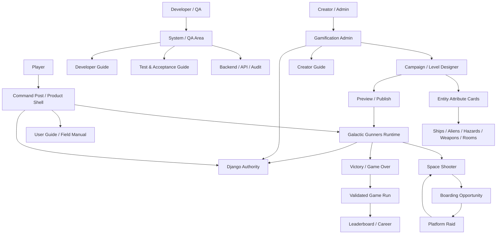

At a high level, **Galactic Gunners is no longer just one arcade game loop**. It is a product made of several connected gameplay and management layers:

- the **core space shooter**;
- the **boarding/platform raid mode**;
- the **campaign/level system**;
- the **player/account/score system**;
- the **Command Post/player-facing dashboard**;
- the **Gamification Admin / Designer**;
- the **backend authority** for users, runs, scores, content and audit;
- the **documentation/testing surfaces** that support players, operators and developers.

The production roadmap already separates the product shell from the Phaser game core and the Django authority layer, and it explicitly keeps Boarding as a separate scene/system family rather than contaminating the shooter itself.

## Overall game/product model



That is the product I would expect us to judge at closeout.

---

# 1. The core game

The foundation remains the classic **Galactic Gunners space-combat loop**.

The player:

**moves → fires → destroys aliens/ships/asteroids → protects shields → survives waves → manages lives/nukes → encounters mothership/bosses → progresses through levels → wins or dies.**

The locked scoring baseline already includes different values for targets and events, including scouts, ships, asteroids, mothership hits/kills and comets; destroying a comet also grants a nuke.

The HUD therefore has real operational meaning:

- Score
- Lives
- Wave
- Nukes
- current level/campaign context
- potentially boarding availability/status

The established visual estate also already provides the dedicated HUD typography and result presentation.

---

# 2. Boarding is a game inside the game

This is one of Galactic Gunners' distinguishing mechanics.

The intended loop is:

```text
SHOOTER
   ↓
eligible enemy ship disabled
   ↓
BOARD or IGNORE
   ↓
dock
   ↓
preserve shooter state
   ↓
enter ship interior
   ↓
platform combat / exploration
   ↓
fight aliens + open containers + acquire rewards
   ↓
return to airlock before time expires
   ↓
return to exactly the preserved shooter session
```

That is explicitly the governed Boarding architecture.

A failure aboard the ship is not supposed to create an entirely different life economy. The boarded ship explodes, the player loses one normal life, and—if lives remain—the shooter resumes.

So from a player UX perspective, Boarding should feel like:

> **“I have interrupted the battle to raid this ship, but I am still inside the same Galactic Gunners run.”**

Not like launching an unrelated second game.

---

# 3. Campaigns and levels

Above the individual shooter/boarding mechanics is a **campaign definition**.

A campaign should determine things such as:

- sequence of levels;
- waves;
- enemy mix;
- hazards;
- ship classes;
- boarding opportunities;
- bosses;
- map/interior definitions;
- possibly rewards and special events.

The runtime then consumes a **published version** of that campaign.

That is an important distinction:

```text
DESIGNER DRAFT
      ↓
PREVIEW
      ↓
VALIDATE
      ↓
PUBLISH
      ↓
VERSIONED CAMPAIGN
      ↓
GAME RUNTIME
```

A creator changing Level 3 should not mutate the running game invisibly.

There should be a publish/version boundary.

---

# 4. Command Post

The **Command Post** is the player/customer dashboard behind the game rather than an administrator console.

I would expect it eventually to show:

- player identity;
- career/high score;
- previous runs;
- levels reached;
- victories;
- leaderboard position;
- achievements;
- potentially favourite/created/shared maps later;
- settings;
- help.

The roadmap already places profile UI, leaderboard UI, settings, help, credits and related product surfaces in the Next.js product layer rather than inside Phaser.

So conceptually:

```text
COMMAND POST
│
├── PLAY
├── PROFILE
├── CAREER / PROGRESS
├── SCORES
├── LEADERBOARD
├── SETTINGS
└── HELP
```

The Phaser game should open from this shell but remain the actual engine.

---

# 5. Gamification Admin / Designer

This is a different audience.

It is where an authorised operator/designer should be able to control:

- campaigns;
- levels;
- waves;
- enemy placement/configuration;
- boarding maps/interiors;
- assets/entities;
- game versions;
- scores;
- users/IAM where authorised;
- logs/audit;
- preview;
- publishing.

This is where the **pallet/grid designer** we have discussed belongs.

It should visually expose the available game objects rather than force someone to know internal IDs.

---

# 6. The “Top Trumps” cards

Yes — I think these are useful, and more importantly, they should become a coherent UX convention rather than a decorative extra.

When someone selects a ship, alien, weapon, hazard or player unit in the Designer, there should be an **entity card**.

For example:

### Alien Scout

```text
ALIEN SCOUT
──────────────
Class          Light
Health         20
Speed          86
Fire Rate      72
Damage         25
Score Value    25
Boardable      No
Threat         ★★☆☆☆
```

### Destroyer

```text
DESTROYER
──────────────
Class          Heavy
Health         250
Speed          35
Firepower      84
Armour         78
Score Value    50
Boardable      Yes
Crew Threat    High
Interior       Destroyer-01
```

### Player craft

```text
GALACTIC GUNNER
──────────────
Lives          3
Mobility       82
Laser          70
Nukes          1
Shielding      55
Special        Nuke
```

The precise values must come from actual game configuration rather than invented UI-only numbers.

That is the critical rule:

**Card = projection of authoritative entity configuration.**

Not:

**Card = marketing graphic maintained separately.**

---

# 7. Where those cards should appear

They are useful in several places.

### Designer

This is the most important.

Click an object in the palette:

```text
[SCOUT]
   ↓
ENTITY CARD
   ↓
attributes
description
allowed placement
runtime dimensions
behaviours
score value
boarding capability
```

Then drag/place it.

### Player information / codex

A lighter version can appear in a game **Intel / Field Manual / Codex**.

As the player encounters things, entries could unlock:

```text
SCOUT
CRUISER
DESTROYER
MOTHERSHIP
COMET
ASTEROID
WEAPONS
BOARDING ROOMS
...
```

This would add genuine game depth without changing the combat.

### Before missions

Campaign briefings could show selected threat cards:

> **KNOWN HOSTILES: Cruiser / Destroyer / Mothership**

### During game

I would **not** constantly show giant cards.

That interferes with the shooter.

Potentially brief contextual overlays:

> `DESTROYER DETECTED`

with only 2–3 important stats.

---

# 8. The documentation question

There should be **different documentation for different audiences**.

They should not all be dumped into one giant README.

## User Guide

Audience:

**player**

Contents should include:

- how to start;
- keyboard controls;
- touch controls;
- controllers;
- weapons;
- nukes;
- shields;
- scoring;
- enemies;
- boarding;
- lives;
- campaign progression;
- leaderboard;
- accounts;
- Command Post.

### Should it be accessible from the game?

**Yes. Absolutely.**

From:

**Main Menu → HOW TO PLAY / FIELD MANUAL**

and:

**Command Post → Help**

A player should never have to visit GitHub to learn the game.

Ideally the user guide is rendered as product content and shares a source with the maintained documentation rather than becoming duplicated HTML.

---

# 9. Creator/Admin Guide

This should probably be treated separately from the ordinary User Guide.

Audience:

- level designers;
- campaign creators;
- authorised Gamification admins.

Accessible from:

**Gamification Admin → Help / Creator Guide**

Contextual help would be even better.

For example:

```text
CAMPAIGN DESIGNER
          [?]
           ↓
How campaign versions work
How Preview differs from Publish
How levels are ordered
```

And:

```text
ENTITY PALETTE
      ↓ select Destroyer
DESTROYER CARD
      ↓
"View full specification"
```

This can open the relevant Creator Guide section.

That is a much stronger UX than requiring a designer to search documentation manually.

---

# 10. Developer Guide

Different audience entirely:

**developers maintaining Galactic Gunners.**

It should explain:

- monorepo architecture;
- Phaser versus Next.js responsibilities;
- Django responsibility;
- database;
- local Docker;
- API contracts;
- configuration;
- scoring authority;
- campaign schema;
- entity schema;
- content publishing;
- asset conventions;
- environment variables;
- authentication;
- adding levels/entities;
- tests;
- deployment.

The production roadmap specifically defines the intended separation:

```text
Next.js = product shell
Phaser = gameplay
Django/DRF = backend authority
Postgres = persistent state
```

### Should the Developer Guide be inside the game?

Not in the ordinary player UI.

That would be inappropriate.

But it **can and should be accessible from the authenticated administration/developer area** if that area understands role permissions.

For example:

**Admin → System → Developer Documentation**

That could link/render:

- API reference;
- architecture;
- local-development guide;
- data models.

Production secrets or operationally sensitive material obviously should not become public simply because documentation exists.

---

# 11. Test Guide

This should be extremely useful for us.

It is not just for Development.

It should define the **acceptance contract of the game**.

There are at least four testing layers:



The roadmap already requires combined QA across web, Windows, mobile/tablet, keyboard, Xbox, Haute M-series, additional gamepads, degraded backend/leaderboard conditions and Boarding.

### Should it be accessible from the game?

Not to ordinary players.

But behind the Admin/Developer boundary, yes.

An excellent production feature would be:

**Admin → QA / Test Guide**

containing:

- manual acceptance scenarios;
- expected results;
- supported control matrix;
- current build/version;
- known test state.

Eventually it could even provide a QA dashboard:

```text
BUILD: 1.3.0
────────────────
Core Shooter      PASS
Boarding          PASS
Keyboard          PASS
Xbox              PASS
Touch             PASS
Leaderboard       PASS
Campaign Publish  PASS
```

That would be genuinely useful rather than documentation theatre.

---

# 12. How the three guides relate



The principle should be:

**one authoritative documentation source, different audience projections.**

Not four copies that drift apart.

---

# 13. Game object model

At closeout I would expect us to be able to identify at least these component families:

| FamilyExamplesRuntime roleDesigner card? |                                 |                            |              |
| ---------------------------------------- | ------------------------------- | -------------------------- | ------------ |
| Player                                   | Gunner craft / boarding player  | Controlled character       | **Yes**      |
| Alien units                              | Scout, platform alien types     | Enemy                      | **Yes**      |
| Enemy ships                              | Cruiser, Destroyer, Mothership  | Combat / boarding targets  | **Yes**      |
| Hazards                                  | Asteroid, comet                 | Environment                | **Yes**      |
| Weapons                                  | Laser, alien laser, nuke        | Combat                     | **Yes**      |
| Defence                                  | Shield tile                     | Defence / destructible map | **Yes**      |
| Boarding rooms                           | Airlock, cargo, bridge, reactor | Platform map modules       | **Yes**      |
| Pickups                                  | Life, nuke, crate/container     | Rewards                    | **Yes**      |
| Campaign                                 | Campaign definition             | Gameplay orchestration     | Summary card |
| Level                                    | Level definition                | Progression                | Summary card |
| Wave                                     | Wave definition                 | Spawn composition          | Summary card |

This gives the designer a coherent mental model.

---

# 14. Example Designer UX

What I would expect:

```text
┌─────────────────────────────────────────────────────────┐
│ LEVEL 04 DESIGNER                         Preview Publish│
├─────────────┬──────────────────────────────┬─────────────┤
│ ENTITY      │                              │ DESTROYER   │
│ PALETTE     │         PLAYFIELD            │             │
│             │                              │ Health 250  │
│ Scout       │      [placed enemies]        │ Armour 78   │
│ Cruiser     │                              │ Speed 35    │
│ Destroyer ──┼──────────────────────────────▶ Fire 84     │
│ Mothership  │                              │ Boardable ✓ │
│ Asteroid    │                              │ Score 50    │
│ Comet       │                              │             │
│             │                              │ [DETAILS]   │
├─────────────┴──────────────────────────────┴─────────────┤
│ Wave 1 | Wave 2 | Wave 3 | Boss                         │
└─────────────────────────────────────────────────────────┘
```

That is where the Top-Trumps analogy works extremely well.

---

# 15. Closeout UX expectations

For Founder acceptance I would assess the product in **four distinct journeys**.

### Player journey

**Landing → Start/Login → Play → Boarding → result → score/leaderboard → replay**

This must feel coherent and enjoyable.

### Returning player journey

**Login → Command Post → progress/scores → Play**

No unnecessary administrative clutter.

### Creator journey

**Admin login → Campaign → Level Designer → select entities → edit → preview → publish → runtime reflects publication**

This must be understandable without touching source code.

### Operator/developer journey

**Admin/System → logs/users/build/docs/testing**

This needs clarity and evidence, not game spectacle.

---

# 16. A key point for your acceptance

The **guides should exist as actual product capability**, not simply repository files.

I would consider these the appropriate expectation:

**Public/player-facing**

- Quick Controls
- How to Play
- Field Manual/Codex
- Boarding guide
- scoring explanation

**Authenticated Command Post**

- richer User Guide
- account/leaderboard help

**Gamification Admin**

- Creator/Admin Guide
- contextual Designer help
- entity specification cards

**Developer/QA boundary**

- Developer Guide
- Test Guide
- API/architecture reference
- build/test status

That makes the documentation genuinely useful.

---

# 17. What I would specifically verify before closeout

There are several things I would not assume are complete merely because their underlying architecture exists.

I would physically test:

1. **Every main-menu button.**
2. **Keyboard, touch and controller paths.**
3. **Score continuity across levels and Boarding.**
4. **Board vs Continue semantics.**
5. **Boarding return to preserved shooter state.**
6. **Campaign levels being materially different.**
7. **Designer save → preview → publish → actual runtime change.**
8. **Admin/Command Post/Django-admin separation.**
9. **Entity palette and attribute cards.**
10. **User/Creator guides reachable from the appropriate UI.**
11. **Dev/Test guides reachable only from appropriate authenticated surfaces.**
12. **Victory/Game Over actions.**
13. **Leaderboard eligibility and Free Play treatment.**
14. **No stale/default imagery or duplicated controls.**
15. **No documentation links that dump an ordinary player into GitHub.**

Because Galactic Gunners' programme doctrine itself says that automated PASS is not commercial acceptance and Founder acceptance is a separate gate.

## In one picture



That is the closeout model I would use: **a playable arcade shooter with a genuinely integrated boarding game, a governed content/campaign system behind it, player and creator dashboards around it, authoritative score/run state underneath it, and documentation/testing presented to the correct audience inside the product rather than merely sitting in the repository.**

And yes: **the Top-Trumps-style entity cards are worth treating as a required UX feature** if the current delivery includes the Designer/entity-selection surface. They make an otherwise technical game-object catalogue comprehensible and useful to both creators and, in lighter form, players.